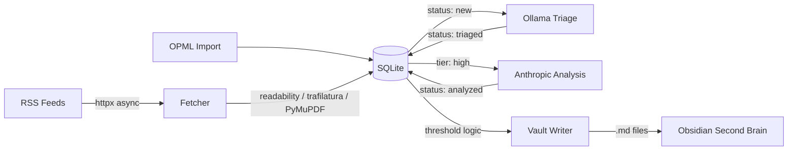

# LEARNING.md

## Project Overview

feed-brain is a personal RSS aggregator that triages articles with a local LLM (Ollama), runs deep analysis on the best ones with Anthropic, and pushes results directly into the Obsidian vault. Started as a FastAPI web app, evolved into a pure CLI pipeline.

## Architecture



Pipeline state machine: `new → triaged → analyzed → integrated | error`

## Tech Stack & Decisions

| Technology | Why | Trade-offs |
|-----------|-----|------------|
| Ollama (llama3.2:3b) | Free, fast, local triage. Pydantic `format=` for structured output | Needs Ollama running locally, less accurate than cloud models |
| Anthropic Sonnet | Deep analysis on high-tier only (cost control) | API key required, cost per call |
| PyMuPDF | Best two-column PDF extraction (`get_text(sort=True)`) | Binary dependency, large package |
| trafilatura | Fallback when readability-lxml produces garbage | Slower than readability, sometimes too aggressive at stripping |
| tenacity | Retry on Ollama parse failures (structured output isn't perfect) | Adds latency on bad responses |
| Direct vault write | No dependency on obsidian CLI, simpler than API | No Obsidian metadata/plugin hooks, just raw files |
| Explicit status enum | Clear pipeline state vs. inferring from nullable timestamps | Extra column, but much easier to query and debug |

## Lessons Learned

### 2026-03-09: The Great Web UI Purge

**Context:** feed-brain had a full FastAPI + htmx web UI with Pico CSS, article cards, feed management, approval workflow. ~1200 lines of web code (routes, templates, CSS).

**Problem:** For a personal tool running locally, the web UI was overkill. The real workflow is: fetch articles, let AI sort them, push the good ones to Obsidian. Nobody needs a browser for that.

**Solution:** Deleted the entire `web/` directory, all templates, CSS, routes. Replaced with 7 CLI commands that map directly to pipeline stages. Net result: -1800 lines deleted, +485 added.

**Takeaway:** Build the simplest interface that matches actual usage. A CLI with `run --auto` is worth more than a polished web UI nobody opens.

### 2026-03-09: AsyncSession Is Not Thread-Safe (Or Concurrency-Safe)

**Context:** Rewrote the fetcher to use `asyncio.gather` with a semaphore for parallel feed fetching. Initially passed a single `AsyncSession` to all concurrent tasks.

**Problem:** Gemini review caught it: SQLAlchemy's `AsyncSession` is stateful and NOT safe for concurrent use. Multiple tasks adding articles to the same session would cause `RuntimeError` or transaction corruption.

**Solution:** Each `_bounded_fetch` task now creates its own session from the factory:
```python
async def _bounded_fetch(source: FeedSource) -> int:
    async with semaphore, session_factory() as session:
        count = await _fetch_single_feed(session, source, settings)
        await session.commit()
        return count
```

**Takeaway:** `AsyncSession` is async, not concurrent. One session per concurrent task, always. The `async_sessionmaker` factory is designed exactly for this pattern.

### 2026-03-09: ALTER TABLE in a Single Transaction Is a Trap

**Context:** Wrote idempotent migrations as a loop of ALTER TABLE statements wrapped in a single `engine.begin()` transaction.

**Problem:** In SQLite (and most DBs), if one ALTER TABLE fails (e.g., column already exists), the entire transaction is invalidated. Subsequent statements in the loop, including the backfill UPDATEs, would crash with `PendingRollbackError`.

**Solution:** Each ALTER TABLE gets its own transaction:
```python
for table, column, col_type in migrations:
    try:
        async with engine.begin() as conn:
            await conn.execute(text(f"ALTER TABLE {table} ADD COLUMN {column} {col_type}"))
    except Exception:
        pass  # Column already exists
```

**Takeaway:** Idempotent migrations need idempotent transactions. One DDL statement = one transaction, especially when you're catching exceptions to skip already-applied changes.

### 2026-03-09: CPU-Bound Work Inside Async Functions Kills Concurrency

**Context:** The extractor calls readability-lxml, BeautifulSoup, and trafilatura, all CPU-bound parsing. These were called directly inside `async def extract_content()`.

**Problem:** CPU-bound work in an async function blocks the event loop. With 10 concurrent fetchers, they'd all stall waiting for one feed's content extraction to finish.

**Solution:** Wrap CPU-bound parsing in `asyncio.to_thread()`:
```python
cleaned = await asyncio.to_thread(_extract_with_readability, html)
```

**Takeaway:** `async` doesn't magically make CPU work concurrent. If it's not I/O, it needs a thread. Rule of thumb: if the function doesn't `await` anything, it probably needs `to_thread`.

## Pitfalls & Gotchas

- **feedparser.parse with a URL** will make its own HTTP request, bypassing your async client. Download XML with httpx first, then `feedparser.parse(xml_string)`.
- **Ollama structured output** (`format=` parameter) works well but isn't bulletproof. The 3b model occasionally produces malformed JSON, hence tenacity retry.
- **SQLite ALTER TABLE** cannot add columns with NOT NULL constraints without defaults. Always use `DEFAULT` in migration DDL.
- **trafilatura import** is slow (~200ms). Lazy-import it only in the fallback path.

## Best Practices Discovered

- **Pipeline status field > nullable timestamps**: `Article.status` is explicit and queryable. No more guessing "is it classified?" by checking `classified_at IS NOT NULL`.
- **Semaphore + session-per-task**: Clean pattern for bounded concurrent DB work in async Python.
- **Download-then-parse**: Decouple HTTP fetching (async, can be concurrent) from parsing (CPU-bound, needs thread). Don't let libraries do their own I/O inside your async code.
- **Structured output with Pydantic schema**: Ollama's `format=Model.model_json_schema()` is cleaner than prompt-engineering JSON output and parsing it yourself.
